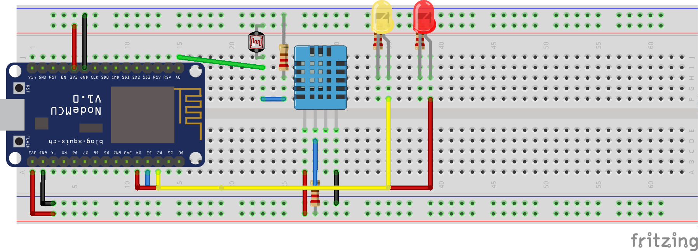
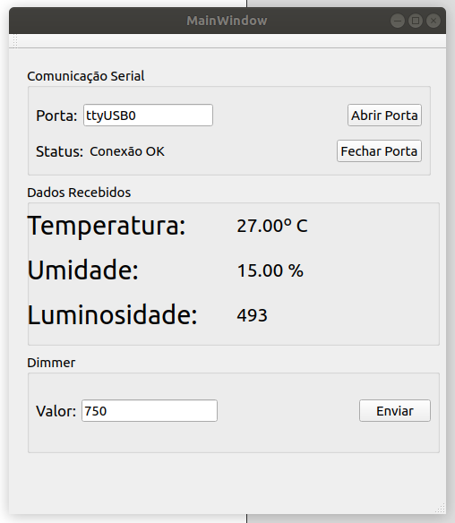

# Projeto Base para Comunicação QT/Arduino

## Protótipo

Este projeto tem como objetivo criar a comunicação em tempo real entre os dados obtidos pelos sensores DHT11 e LDR, conectados a um NodeMCU,  com uma aplicação desktop desenvolvida em QT.

O projeto conta com um LED que é acionado automaticamente quando a luminosidade é inferior a um limite pré-estabelecido (LED amarelo) e com um LED que tem a sua intensidade controlado pelo usuário através da interface de comunicação (LED vermelho).

### Modelo das conexões entre os componentes

## Tela de Controle

A tela de controle permite ao usuário indicar em qual porta o protótipo está conectado, verificar os dados obtidos em tempo real pelo dispositivo e determinar a intensidade de iluminação do LED vermelho.

## Códigos desenvolvidos para o controlador

Para este projeto foram desenvolvidas duas bibliotecas para integrar os sensores e LEDs.

### A classe MyLed

A classe MyLed permite o controle facilitado dos LEDs  utilizados no projeto.

#### MyLed.h 
~~~
#ifndef MYLED.H
#define MYLED.H

#include "Arduino.h"
class MyLed{
	private:
  		int pino;
  	public:
  		MyLed(int p);
  		void acender();
  		void apagar();
  		void blink(int intervalo);
  		void dimmer(int valor);
  		void fadeIn(int intervalo);
  		void fadeOut(int intervalo);
};

#endif

~~~

#### MyLed.cpp

~~~
#include "myled.h"
MyLed::MyLed(int p){
	pino = p;
  	pinMode(pino,OUTPUT);
}

void MyLed::acender(){
	digitalWrite(pino,HIGH);
}

void MyLed::apagar(){
	digitalWrite(pino,LOW);
}

void MyLed::blink(int intervalo){
	acender();
  	delay(intervalo);
  	apagar();
  	delay(intervalo);
  
}

void MyLed::dimmer(int valor){
  if(valor >= 0 and valor <=1023){
    	analogWrite(pino, valor);
  }	
}

void MyLed::fadeIn(int intervalo){

  for(int i=0; i<=255; i+=25){
    dimmer(i);
    delay(intervalo);
  }
}

void MyLed::fadeOut(int intervalo){

  for(int i=255; i>=0; i-=25){
    dimmer(i);
    delay(intervalo);
  }
}

~~~

### A classe MySensor

A classe MySensor integra o sensor DHT11 e o LDR como um único objeto, facilitando o controle e configuração dos sensores.

#### MySensor.h

~~~
#ifndef MY_DHT.H
#define MY_DHT.H

#include "Arduino.h"
#include "DHT.h"

class My_Sensor: public DHT {

	int pinLdr;
	public:
		My_Sensor(int pin, int type, int ldr);
		String readAll();
		int readLdr();
};

#endif
~~~

#### MySensor.cpp

~~~
#include "Arduino.h"
#include "My_Sensor.h"

My_Sensor::My_Sensor(int pin, int type, int ldr) : DHT(pin, type){
	pinLdr = ldr;
}

String My_Sensor::readAll(){
	return "temp="+String(readTemperature())+"&umidade="+String(readHumidity())+"&luminosidade="+String(readLdr());
}

int My_Sensor::readLdr(){
	return analogRead(pinLdr);
}
~~~

### Código principal do controlador

~~~

#include <myled.h>
#include <My_Sensor.h>
#include <ESP8266WiFi.h>
#include <ESP8266HTTPClient.h>

#define DHTPIN 0 
#define DHTTYPE DHT11
#define LDR A0
#define AMARELO 5
#define VERMELHO 2

#define HEROKU "http://iot-ifpb.herokuapp.com/sensor"

#define WIFI_SSID "iot-lacouth"
#define WIFI_PASSWORD "iot-password"

My_Sensor dht(DHTPIN, DHTTYPE, LDR);
MyLed amarelo(AMARELO);
MyLed vermelho(VERMELHO);

void setupWifi(){
  WiFi.begin(WIFI_SSID, WIFI_PASSWORD);
  Serial.print("connecting");
  while (WiFi.status() != WL_CONNECTED) {
    Serial.print(".");
    delay(500);
  }
  Serial.println();
  Serial.print("connected: ");
  Serial.println(WiFi.localIP());
}

void setup() 
{
  Serial.begin(9600);
  dht.begin();
  setupWifi();
}

void loop() 
{
  
      
    float h = dht.readHumidity();
    float t = dht.readTemperature();
    String led_status = "False";

    HTTPClient http;

    if (isnan(t) || isnan(h)){
      Serial.println("Falhou a leitura do DHT");
    }else{ 

      

      if(dht.readLdr() <= 300){
          amarelo.acender();
          led_status = "True";
          
      }else{
          amarelo.apagar();
          led_status = "False";
      }

//------------------Enviando e Recebendo dados da Serial-----------------------------------

      String serialData = String(dht.readTemperature()) + "," +
                          String(dht.readHumidity()) + "," + 
                          String(dht.readLdr()) + "," + 
                          led_status; 

      Serial.println(serialData);

      if(Serial.available() > 0 ){
        int brilho = Serial.parseInt();
        vermelho.dimmer(brilho);
      }
//-----------------------------------------------------------------------------------------
      
//------------------Enviando dados para nuvem---------------------------------

      String cloudData = dht.readAll()+"&led="+led_status;
      http.begin(HEROKU);
      http.addHeader("Content-Type", "application/x-www-form-urlencoded");
      http.POST(cloudData);
      http.end();
//------------------------------------------------------------------------------
            
    }
  delay(500);
}

~~~

## Principais métodos para comunicação entre o QT e o NodeMCU

No repositório principal estão os códigos referentes a aplicação desenvolvida no QT, mas alguns métodos precisam de uma explicação para que seja possível utilizar o código em outros projetos.

### mainwindow.h

A classe mainwindow.h possui entre outros métodos o seguintes métodos:

~~~
	bool abrirPorta(QString portName);
	void fecharPorta();
	void enviarComando(QString comando);
	void dadosRecebidos();
~~~

O método `bool abrirPorta(QString portName);` é responsável por dado o nome de uma porta de comunicação (COM1, COM3, ttyUSB0, etc ) "abrir" a porta e iniciar o processo de envio e recebimento de dados. O método retorna um valor booleano para sinalizar se a porta foi aberta ou não.

O método `void fecharPorta();` fecha a porta de comunicação atualmente aberta.

O método `void enviarComando(QString comando);` recebe como parâmetro uma `QString` e envia esse valor pela porta de comunicação aberta.

O método `void dadosRecebidos();` é o método mais importante da comunicação entre o QT/NodeMCU, pois ele é invocado toda vez que um novo valor é recebido na porta de comunicação. Segue abaixo a implementação atual:

~~~

oid MainWindow::dadosRecebidos()
{
    
//-------------- DADOS BRUTOS DA SERIAL----------------
    QString data; //NÃO ALTERAR
    data = readData(); // NÃO ALTERAR
    
    
//-----ALTERE O CÓDIGO A PARTIR DESSE PONTO PARA A SUA APLICAÇÃO------------
    
    QStringList valores;
    if (not data.contains("Falhou")){
        valores = data.split(",");
        ui->tempLabel->setText(valores[0] + "º C");
        ui->umidLabel->setText(valores[1] + " % ");
        ui->lumiLabel->setText(valores[2]);
    }
}
~~~ 

